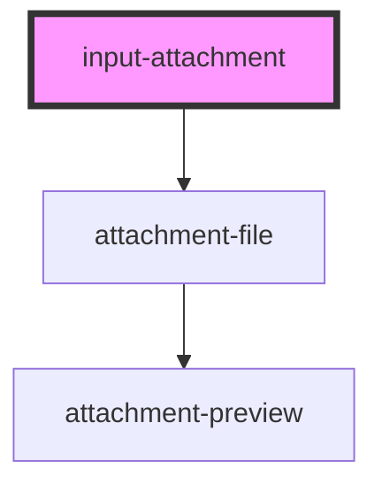

# input-attachment

<!-- Auto Generated Below -->

## Properties

| Property       | Attribute      | Description | Type      | Default     |
| -------------- | -------------- | ----------- | --------- | ----------- |
| `accepts`      | `accepts`      |             | `string`  | `undefined` |
| `directupload` | `directupload` |             | `string`  | `undefined` |
| `disabled`     | `disabled`     |             | `boolean` | `false`     |
| `max`          | `max`          |             | `number`  | `undefined` |
| `multiple`     | `multiple`     |             | `boolean` | `false`     |
| `name`         | `name`         |             | `string`  | `undefined` |
| `preview`      | `preview`      |             | `boolean` | `true`      |
| `required`     | `required`     |             | `boolean` | `false`     |

## Shadow Parts

| Part      | Description |
| --------- | ----------- |
| `"title"` |             |

## Dependencies

### Depends on

- [attachment-file](../attachment-file)

### Graph

----------------------------------------------

*Built with [StencilJS](https://stenciljs.com/)*
